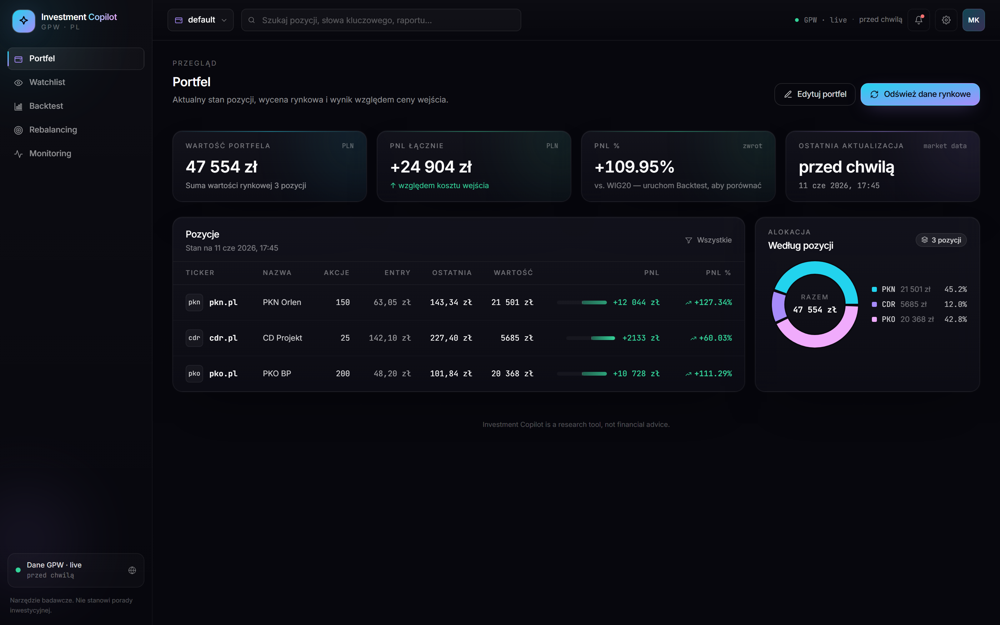
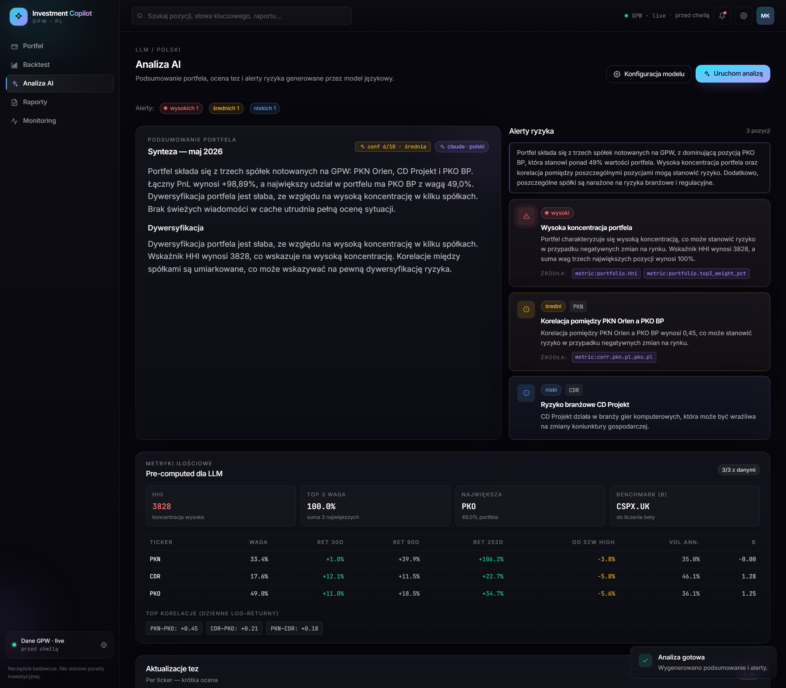
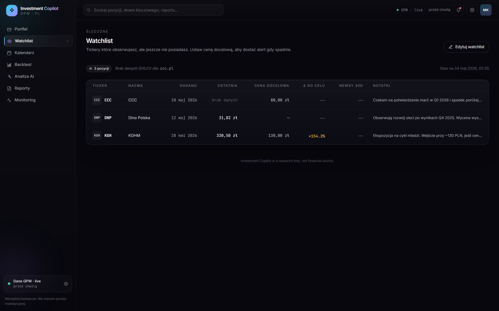
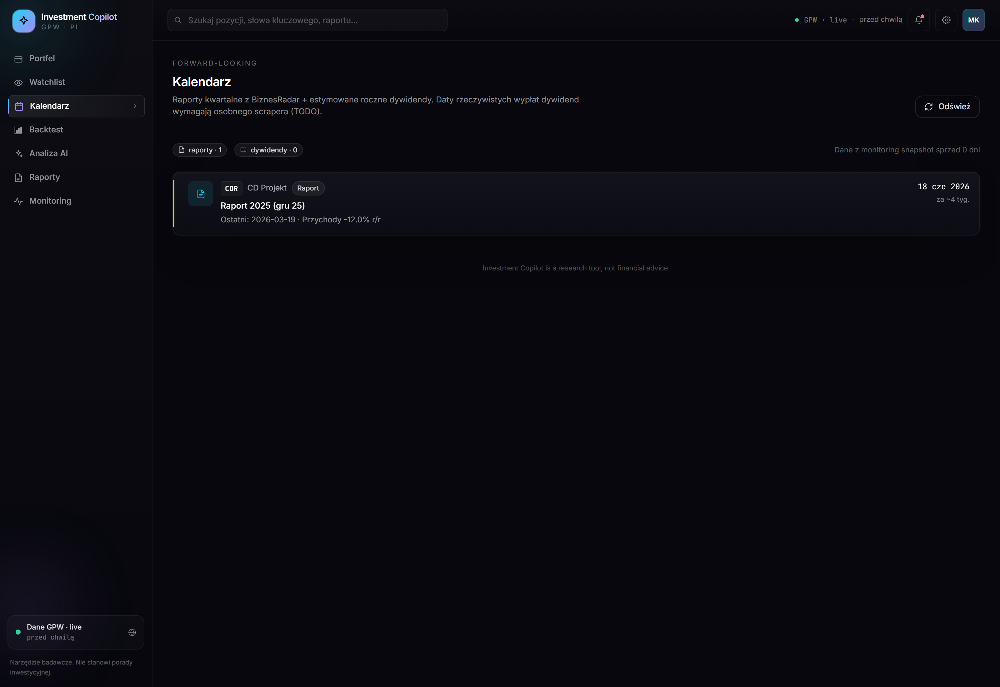
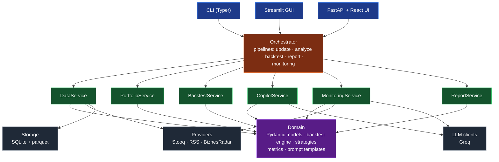

# Investment Copilot

A long-term investing companion for the **Polish stock market (GPW)**. Tracks a manually defined portfolio, fetches free market data, runs backtests, and produces structured Polish-language analyses powered by [Groq](https://groq.com).

> Investment Copilot is a **decision-support tool**, not a trading bot. Its outputs are research material, never financial advice.

---

## Overview

Investment Copilot helps an intermediate-level GPW investor maintain a disciplined process: track holdings against their original investment thesis, refresh market data and news on demand, run reproducible backtests, and ask an LLM to produce structured Polish summaries, risk alerts, and thesis assessments.

Designed to be:

- **Modular** — ports-and-adapters layout, every external dependency lives behind a `Protocol` and is swappable in one file.
- **Polish-market-first** — Stooq for OHLCV (full GPW history, free API key required), RSS feeds (Bankier, Money.pl) for news, WIG20 as the default benchmark.
- **Three surfaces over one core** — CLI (Typer), Streamlit GUI, and a FastAPI + React web dashboard, all driving the same `ServiceContainer` + `Orchestrator`.


<sub>_Web GUI — Portfolio tab. Regenerate with `python docs/_capture_screenshot.py` while uvicorn runs on port 8765._</sub>


<sub>_Analiza AI — confidence badge, risk overview, grounded alerts with citation chips, and the same quant metrics block (HHI, returns, correlations) the LLM was citing. Regenerate with `python docs/_capture_analysis_screenshot.py`._</sub>


<sub>_Watchlist — research tickers with optional target buy prices, distance to target, and 30-day news count (updated together with portfolio data via the same "Odśwież dane rynkowe" button)._</sub>


<sub>_Kalendarz — upcoming earnings reports parsed from the latest monitoring snapshot's BiznesRadar data (next_report_estimated_date per holding). Annual dividend estimates appear when BR returns a non-zero dividend yield. Empty until the first **Monitoring → Uruchom snapshot**._</sub>

---

## Quick Start

Fastest path to a running web dashboard:

```bash
git clone <your-fork-url> investment-copilot && cd investment-copilot

# 1. Install (core + web API extras)
uv sync && uv pip install -e ".[api]"

# 2. Generate config files (UTF-8 safe on Windows)
uv run invcopilot init

# 3. Add API keys to .env — both are free
#    GROQ_API_KEY=...    (console.groq.com/keys)
#    STOOQ_API_KEY=...   (stooq.pl/q/d/?s=pkn.pl&get_apikey)

# 4. Edit portfolio.yaml with your real holdings

# 5. Launch
uv run uvicorn investment_copilot.api.main:app --port 8000
# → http://localhost:8000   (dashboard)
# → http://localhost:8000/docs   (OpenAPI)
```

In the dashboard: click **Odśwież dane rynkowe** (Portfolio tab) → wait ~20 s → everything else (Backtest / AI / Reports / Monitoring) is ready.

For automation / cron, see [CLI usage](#cli-usage). For full setup details and other surfaces, see [Setup](#setup) and [Usage](#usage).

---

## Features

- **Portfolio tracking** — define holdings in `portfolio.yaml` with shares, entry price, entry date, investment thesis, optional name and news keywords.
- **Free, fast data** — daily OHLCV from Stooq for any GPW ticker (free API key required, see [API keys](#api-keys)). Indices (`wig20`, `mwig40`, etc.) and equities are queried through the same adapter.
- **News aggregation** — multiple Polish RSS feeds plus best-effort scraping of Stooq's per-symbol news block. Persisted in SQLite, deduplicated by URL, queryable per ticker.
- **Backtesting** — portfolio-level simulator with three strategies (MA-crossover, time-series momentum, buy & hold). Equal-weight across active sleeves, daily checks, end-of-day fills, no leverage, no shorts, zero costs (v1). Equity curve and a full metrics suite (total / annualized return, volatility, Sharpe @ 252, max drawdown with duration, win rate). Configurable benchmark (`wig20` / `mwig40` / `swig80` / `wig` / `wig30` / arbitrary Stooq ticker) buy-and-hold in the same window.
- **Groq copilot** — three structured analyses with Polish output: portfolio summary, risk alerts, thesis update. JSON-mode + Pydantic validation, automatic self-correction on schema violations, exponential backoff on transient errors, fast-fail on auth errors.
- **Grounded analysis** — quantitative metrics (HHI, top-3 concentration, per-holding 30/90/252d returns, distance from 52w high, annualized volatility, beta vs benchmark, top pairwise correlations) are computed in Python and injected into the prompt; the LLM cites specific `metric:KEY` / `news:N` / `fundamentals:TICKER.field` / `previous_report:LABEL` references; hallucinated citations are stripped Python-side before the result reaches the user. The last 2 Markdown reports are folded back in as RAG context so each run is framed as a delta over prior assessments.
- **Watchlist** — tickers you research but don't own. Separate `watchlist.yaml`, optional `target_buy_price` per item (UI flags when current price hits the target), last price from the same OHLCV cache. **Update data** now refreshes watchlist OHLCV alongside portfolio holdings and merges watchlist keywords into the RSS news pipeline, so each item shows a 30-day news count next to its price. Edit through the Web GUI dialog or the YAML directly.
- **Forward-looking calendar** — earnings report dates pulled from the latest monitoring snapshot's BiznesRadar fields (`next_report_estimated_date` per holding), plus annual dividend estimates (`yield × market_value`). Date-less dividend estimates are surfaced as yearly totals; actual ex-dividend / payment dates require a separate scraper (planned).
- **CLI** — Typer-based commands (`update-data`, `run-analysis`, `backtest`, `generate-report`) with Rich-rendered tables, severity-coloured risk panels, sensible exit codes, and graceful degradation when the LLM is unreachable.
- **Markdown reports** — generated to `reports/`, fully Polish, with portfolio table, backtest metrics vs benchmark, AI sections, and warnings.
- **Local persistence** — SQLite for news + metadata, parquet for OHLCV. Restart-safe, queryable, no ORM overhead.
- **API-first design** — `ServiceContainer` constructs every service from `AppConfig`; the same wiring will power a future FastAPI app via `Depends(get_container)`.

---

## Architecture

### Layers



Dependency rule: arrows point **downward only**. Domain knows nothing about infrastructure. Services depend on domain + infrastructure interfaces. Orchestration depends on services. Entrypoints depend on the orchestrator.

### Data flow — `generate-report`

```
CLI (Typer)
  └─► Orchestrator.generate_report()
        ├─► PortfolioService.current_status()        → PortfolioStatus
        ├─► BacktestService.run()                    → BacktestResult
        │     ├─► load OHLCV from parquet cache
        │     ├─► Strategy.generate_signals()
        │     ├─► simulate_portfolio()               → equity curve
        │     └─► compute_metrics()                  → Sharpe / DD / …
        ├─► CopilotService.analyze_portfolio()       → PortfolioAnalysis
        │     ├─► load news from SQLite              → indexed as news:1..N
        │     ├─► compute_portfolio_metrics()        → HHI, returns, beta, corr
        │     ├─► load_recent_reports()              → RAG context (last 2 .md)
        │     ├─► build_portfolio_context()          → Markdown blocks
        │     ├─► render Polish prompt template      → citation rules + examples
        │     ├─► GroqClient.complete_structured()   → Pydantic + citations
        │     └─► _validate_*_citations()            → drop unknown refs
        ├─► CopilotService.detect_risks()            → RiskAlerts (grounded)
        └─► ReportService.write()                    → reports/*.md
```

Every arrow is a typed call. Every box is independently testable. The orchestrator captures non-fatal errors (LLM timeouts, missing benchmark data, etc.) into a `warnings` list rather than aborting the run — so a partial result is always available.

### Grounded analysis

The LLM is treated as an **interpreter**, never a calculator. Three layers of grounding sit between raw data and the model:

1. **Quant metrics block.** Before each call, `compute_portfolio_metrics()` produces a Pydantic `PortfolioMetrics` from the OHLCV cache + benchmark series:
   - Portfolio-level: HHI (Herfindahl-Hirschman), top-3 weight, largest position
   - Per-holding: weight, returns 30d/90d/252d, distance from 52w high/low, annualized volatility, beta vs benchmark
   - Cross-holding: up to 5 strongest pairwise correlations of daily log returns
   These render as a `## Quant metrics` Markdown block with stable citation keys (`metric:portfolio.hhi`, `metric:pkn.pl.ret_30d_pct`, `metric:corr.pkn.pl.pko.pl`).

2. **Indexed news.** `render_news()` prefixes each headline with `news:N`. The LLM cites specific items rather than paraphrasing.

3. **RAG over reports.** `load_recent_reports()` reads the last 2 Markdown reports from `reports/*.md`, extracts the substantive sections (summary / risks / theses), and feeds them as `previous_report:LABEL` so the new run is framed as a delta.

The output schemas (`HoldingComment`, `RiskAlert`) require a `citations: list[Citation]` field; the system prompt mandates ≥1 citation per claim. After the LLM returns, `_validate_*_citations()` checks every reference against a `CitationRegistry` built from the same sources fed into the prompt — **unknown references are dropped, hallucinations are logged**. Lenient by design: the model is encouraged to over-cite rather than fabricate, and we strip the bad ones rather than failing the whole run.

The Web GUI surfaces all of this so the user can spot-check: the **Analiza AI** tab renders a `Metryki ilościowe` card with HHI / top-3 / per-holding returns / top correlations next to the LLM output, plus colored citation chips under each risk alert and thesis update. Confidence (1-10) and the risk overview text are visible in the header. See the [analysis screenshot](docs/web-gui-analysis-screenshot.png).

### Project layout

```
investment-copilot/
├── pyproject.toml
├── config.example.yaml
├── portfolio.example.yaml
├── .env.example
├── streamlit_app.py                  # Streamlit GUI entrypoint
├── data/                             # gitignored (cache + parquet)
├── reports/                          # gitignored (Markdown + monitoring HTML)
├── src/investment_copilot/
│   ├── cli.py                        # Typer app
│   ├── orchestrator.py               # named pipelines
│   ├── config/                       # AppConfig + loader
│   ├── domain/
│   │   ├── models.py                 # core types (Ticker, NewsItem, ...)
│   │   ├── portfolio.py              # Holding, Portfolio, status models
│   │   ├── watchlist.py              # WatchlistItem, Watchlist (research tickers)
│   │   ├── calendar.py               # CalendarEvent, CalendarBundle (forward-looking)
│   │   ├── fundamentals.py           # fundamentals + monitoring snapshots
│   │   ├── analysis_metrics.py       # HHI, beta, returns, correlations, CitationRegistry
│   │   ├── strategies/               # MACrossover, Momentum, BuyAndHold
│   │   ├── backtest/                 # engine, metrics, results
│   │   └── prompts/                  # context builder, schemas, templates (+ Citation)
│   ├── infrastructure/
│   │   ├── providers/                # Stooq, RSS, BiznesRadar, factory
│   │   ├── llm/                      # GroqClient, factory, errors
│   │   ├── storage/                  # SQLite + parquet
│   │   └── logging.py
│   ├── services/
│   │   ├── data_service.py
│   │   ├── portfolio_service.py
│   │   ├── backtest_service.py
│   │   ├── copilot_service.py        # LLM analyses + citation validation
│   │   ├── analysis_history.py       # RAG loader over reports/*.md
│   │   ├── watchlist_service.py      # watchlist YAML + status enrichment
│   │   ├── calendar_service.py       # forward-looking events aggregator
│   │   ├── monitoring_service.py
│   │   ├── report_service.py
│   │   ├── container.py              # ServiceContainer factory
│   │   └── pipeline_results.py
│   ├── gui/                          # Streamlit helpers (formatters, frames)
│   └── api/                          # FastAPI app
│       ├── main.py                   # app factory + all routes
│       ├── schemas.py                # wire DTOs
│       ├── adapters.py               # domain → DTO conversions
│       └── deps.py                   # FastAPI dependencies
├── src/frontend/                     # Web GUI (CDN React, no build step)
│   ├── index.html                    # Tailwind via CDN, Babel-transpiled JSX
│   └── src/
│       ├── app.jsx                   # tab shell + state
│       ├── api.jsx                   # window.API fetch wrappers
│       ├── portfolio.jsx · backtest.jsx · analysis.jsx
│       ├── reports.jsx · monitoring.jsx
│       └── primitives.jsx · sidebar.jsx · icons.jsx · mockData.jsx
└── tests/                            # pytest suite
```

---

## Setup

### Prerequisites

- Python **3.11** or 3.12
- [`uv`](https://docs.astral.sh/uv/) (recommended) or plain `pip`
- A [Groq API key](https://console.groq.com/keys) — free tier is sufficient
- A [Stooq API key](https://stooq.pl/q/d/?s=pkn.pl&get_apikey) — free, obtained via one-time captcha

### Install

```bash
git clone <your-fork-url> investment-copilot
cd investment-copilot

# with uv (recommended)
uv sync                              # installs deps + dev extras into .venv
uv tool install --editable .         # editable install of the package

# or with pip
python -m venv .venv && source .venv/bin/activate
pip install -e ".[dev]"
```

After install, the `invcopilot` command is available on `PATH`:

```bash
uv run invcopilot version
# investment-copilot 0.1.0
```

### First-run configuration

The fastest path is the `init` command, which creates `config.yaml`, `portfolio.yaml`, `.env`, and `.gitignore` for you in **UTF-8 without BOM** — which matters on Windows because Notepad otherwise saves as UTF-16 LE and `python-dotenv` won't read it.

```bash
invcopilot init                  # creates files in the current directory
invcopilot init ~/my-portfolio   # or somewhere else
invcopilot init . --force        # overwrite existing files
```

Then edit `.env` to set `GROQ_API_KEY` and `portfolio.yaml` with your real holdings.

If you prefer to copy the example files manually:

```bash
cp config.example.yaml config.yaml
cp portfolio.example.yaml portfolio.yaml
cp .env.example .env

# edit .env and set GROQ_API_KEY and STOOQ_API_KEY
# edit portfolio.yaml with your real holdings
```

Both `config.yaml` and `portfolio.yaml` are gitignored by default so secrets and personal positions never end up in git.

### Encoding (Windows Notepad gotcha)

The loader transparently handles `.env`, `config.yaml`, and `portfolio.yaml` saved in any of: UTF-8, UTF-8 with BOM, UTF-16 LE (Notepad's "Unicode"), UTF-16 BE, and CP1250. Files in non-UTF-8 encodings will load fine but emit a warning suggesting you re-save them.

If you do want to fix it manually:

- **Notepad:** File → Save As → Encoding dropdown → **UTF-8** (not "UTF-8 with BOM" and not "Unicode").
- **VS Code:** click the encoding indicator in the bottom-right status bar → "Save with Encoding" → "UTF-8".
- **PowerShell:** `Get-Content .env | Set-Content -Encoding UTF8 .env` (this rewrites in UTF-8 without BOM in PowerShell 7+; on Windows PowerShell 5.1, use `Out-File` with `-Encoding utf8NoBOM`).

### Network notes

- **Stooq** requires a free API key (see [API keys](#api-keys) below). If you sit behind a strict outbound proxy, allow `stooq.com`.
- **Groq** is reached at `api.groq.com`.
- The Stooq adapter handles HTTP errors as `ProviderError`s — a single ticker failing never aborts the rest of the refresh.

### Run the tests

```bash
uv run pytest -q                     # runs in seconds; all pure-Python, no network
```

---

## API keys

Investment Copilot resolves environment variables inside `config.yaml` using `${VAR}` and `${VAR:-default}` syntax. `.env` is loaded automatically at startup via `python-dotenv`.

| Variable | Required | Used by |
|---|---|---|
| `GROQ_API_KEY` | yes | `llm.api_key` (Groq calls) |
| `STOOQ_API_KEY` | yes | Stooq OHLCV CSV endpoint |
| `NEWSAPI_KEY` | no | optional NewsAPI provider (placeholder; not wired in v1) |
| `ALPHA_VANTAGE_KEY` | no | optional Alpha Vantage fundamentals (placeholder; v2) |

- **Groq key** — <https://console.groq.com/keys>. The free tier is generous enough for routine use.
- **Stooq key** — visit <https://stooq.pl/q/d/?s=pkn.pl&get_apikey>, complete the captcha, and copy the `apikey` value from the generated download URL. The key is free and does not expire.

If a referenced env var is missing **and** has no default, the CLI exits with a clear `error:` line and code `1` — the application never starts in a half-configured state.

---

## Example `config.yaml`

```yaml
# All sections are optional except `llm.api_key`. Defaults match v1 spec.

providers:
  market_data: stooq                  # only "stooq" supported in v1
  news:                               # ordered list; each provider is queried
    - stooq
    - rss
  fundamentals: none                  # "alpha_vantage" or "none"
  rss_feeds:
    - https://www.bankier.pl/rss/wiadomosci.xml
    - https://www.money.pl/rss/

storage:
  sqlite_path: data/cache.db
  parquet_dir: data/ohlcv

portfolio:
  path: portfolio.yaml

strategies:
  ma_crossover:
    fast: 50                          # must be < slow
    slow: 200
  momentum:
    lookback: 126                     # ~6 months of trading days
    threshold: 0.0                    # min trailing return to go long

backtest:
  start_date: 2020-01-01
  # end_date: 2025-12-31              # optional; omit for "latest available"
  benchmark: wig20                    # wig20 / mwig40 / swig80 / wig / wig30
  initial_capital: 100000
  trading_days_per_year: 252

llm:
  provider: groq
  api_key: ${GROQ_API_KEY}            # required
  model_analysis: llama-3.3-70b-versatile
  model_summary: llama-3.1-8b-instant
  language: pl                        # output language for AI artifacts
  temperature: 0.3
  max_tokens: 2048
  request_timeout_s: 60

logging:
  level: INFO                         # DEBUG / INFO / WARNING / ERROR
```

Unknown top-level keys are rejected at load time (typo-safe). Cross-field rules are enforced too — e.g., `ma_crossover.slow` must be greater than `fast`.

---

## Example `portfolio.yaml`

```yaml
base_currency: PLN

# Tickers are normalized to Stooq form: "PKN", "PKN.WA", and "pkn.pl" are
# all equivalent and stored as "pkn.pl" internally.
#
# Optional per-holding fields:
#   name      — display name shown in reports.
#   keywords  — substrings used to filter RSS news. Defaults to the ticker
#               stem (e.g. "PKN") which often misses news that uses brand
#               names ("Orlen"). Set keywords explicitly for best matching.
#
# `entry_price` and `entry_date` drive live PnL tracking only. The
# backtester ignores them and runs strategies from `backtest.start_date`
# in config.yaml — otherwise results would be biased by your real entries.

holdings:
  - ticker: pkn.pl
    name: PKN Orlen
    shares: 100
    entry_price: 65.40
    entry_date: 2023-04-12
    keywords: [Orlen, PKN]
    thesis: |
      Integrated energy & refining champion. Dividend policy + Orlen-Lotos
      synergies. Risk: regulated prices, political exposure.

  - ticker: cdr.pl
    name: CD Projekt
    shares: 25
    entry_price: 142.10
    entry_date: 2024-01-08
    keywords: [CD Projekt, CDR, Cyberpunk, Witcher]
    thesis: |
      Long-cycle IP holder (Witcher, Cyberpunk). Pipeline visibility through
      the next flagship release. Risk: execution and release-window slippage.
```

Validation rules: positive shares and entry prices, no future entry dates, non-empty thesis, no duplicate tickers (after normalization), no unknown fields.

---

## Usage

Three surfaces sit over the same `ServiceContainer` + `Orchestrator`. Pick the one that matches what you're doing:

| Surface | Best for | Install | Launch |
|---|---|---|---|
| **Web GUI** (FastAPI + React) | Daily interactive review, editing the portfolio, charts | `uv pip install -e ".[api]"` | `uv run uvicorn investment_copilot.api.main:app --port 8000` |
| **CLI** (Typer) | Cron jobs, scripted refresh, headless servers | _(core install)_ | `uv run invcopilot --help` |
| **Streamlit GUI** | Legacy local poking, single-file alternative to the React UI | `uv pip install -e ".[gui]"` | `uv run streamlit run streamlit_app.py` |

All three read the same `config.yaml`, `portfolio.yaml`, and `GROQ_API_KEY` / `STOOQ_API_KEY` env vars — there's no separate state.

### Web GUI

A polished single-page dashboard. Backend is a thin FastAPI layer over the orchestrator; frontend is a CDN-served React app in `src/frontend/` (no build step). Both run in one process.

```bash
uv pip install -e ".[api]"
uv run uvicorn investment_copilot.api.main:app --port 8000
# Dashboard:    http://localhost:8000
# OpenAPI docs: http://localhost:8000/docs
```

Uvicorn binds **127.0.0.1** by default — single-user, no auth. Do not pass `--host 0.0.0.0` without putting auth in front. Add `--reload` during development to pick up Python changes automatically.

| Tab | Endpoints | What it does |
|---|---|---|
| 📊 **Portfolio** | `GET/PUT /api/portfolio`, `/portfolio/status`, `POST /api/data/update` | Live PnL, holdings table, allocation donut, edit dialog, market-data refresh |
| 👁️ **Watchlist** | `GET/PUT /api/watchlist`, `/watchlist/status` | Tickers you're researching but don't own; optional target buy price + alert when reached; 30-day news count per item |
| 📅 **Kalendarz** | `GET /api/calendar` | Upcoming earnings reports + annual dividend estimates, sourced from the latest monitoring snapshot |
| 📈 **Backtest** | `POST /api/backtest` | Strategy picker (3), benchmark dropdown, configurable date range, percent-return equity curve + drawdown, metrics |
| ✨ **AI Analysis** | `POST /api/analysis` | Polish summary, thesis updates, severity-coded risk alerts |
| 📄 **Reports** | `GET/POST /api/reports`, `/reports/{name}` | Generate, browse, preview, download Markdown reports |
| 👁️ **Monitoring** | `POST /api/monitoring`, `/monitoring/reports` | LLM-driven thesis-monitoring snapshots, historical HTML reports (no CLI equivalent in v1) |

State persists across tab switches — once you run a backtest or analysis, the result stays visible until you re-run it.

For the full endpoint reference (request shapes, curl examples, design notes), jump to [Web API reference](#web-api-reference).

### Streamlit GUI

```bash
uv pip install -e ".[gui]"
uv run streamlit run streamlit_app.py        # http://localhost:8501
```

Four tabs (Portfolio / Backtest / AI Analysis / Reports) over the same orchestrator pipelines. Kept around for users who prefer one-file Python over a React app. The web GUI is the recommended surface going forward.

### CLI

Full command reference below in [CLI usage](#cli-usage). Quick taste:

```bash
uv run invcopilot update-data
uv run invcopilot backtest -s buy_and_hold
uv run invcopilot generate-report -o weekly.md
```

---

## CLI usage

```bash
invcopilot --help
```

### Global options

| Flag | Env var | Default | Description |
|---|---|---|---|
| `--config`, `-c` | `COPILOT_CONFIG` | `config.yaml` | Path to config file. |
| `--portfolio`, `-p` | `COPILOT_PORTFOLIO` | _(value in `config.yaml`)_ | Override the portfolio path. Useful for multi-portfolio workflows. |
| `--log-level` | — | _(`logging.level` from config)_ | One of `DEBUG`, `INFO`, `WARNING`, `ERROR`. |

### Commands

#### `invcopilot update-data`

Refresh OHLCV (per holding + benchmark) and news caches.

```bash
invcopilot update-data
invcopilot update-data --news-days-back 30
```

| Flag | Default | Description |
|---|---|---|
| `--news-days-back`, `-n` | `14` | How far back to fetch news. |

#### `invcopilot run-analysis`

Compute current PnL and run AI analysis (and optionally risks).

```bash
invcopilot run-analysis
invcopilot run-analysis --no-risks
```

| Flag | Default | Description |
|---|---|---|
| `--no-risks` | false | Skip the risk-alerts call (faster, half the LLM cost). |
| `--news-days-back`, `-n` | `14` | News window for AI context. |

#### `invcopilot backtest`

Run a strategy backtest over the portfolio.

```bash
invcopilot backtest -s ma_crossover
invcopilot backtest -s momentum --no-benchmark
```

| Flag | Default | Description |
|---|---|---|
| `--strategy`, `-s` | `ma_crossover` | One of `ma_crossover`, `momentum`, `buy_and_hold`. |
| `--no-benchmark` | false | Skip WIG20 buy-and-hold benchmark column. |

#### `invcopilot generate-report`

Run the full pipeline (status + backtest + AI analysis + risks) and write a Markdown report to `reports/`.

```bash
invcopilot generate-report
invcopilot generate-report -s momentum -o monthly_review.md
invcopilot generate-report --strategy ""           # skip the backtest section
```

| Flag | Default | Description |
|---|---|---|
| `--strategy`, `-s` | `ma_crossover` | Strategy to backtest within the report. Pass `""` to skip. |
| `--news-days-back`, `-n` | `14` | News window for AI context. |
| `--filename`, `-o` | _(timestamped)_ | Override the auto-generated filename (`report_YYYYMMDD_HHMMSS.md`). |

#### `invcopilot version`

Print the installed version and exit.

#### `invcopilot init`

Create starter `config.yaml`, `portfolio.yaml`, `.env`, and `.gitignore` files. All written as **UTF-8 without BOM** so they load cleanly on Windows even after editing in Notepad.

```bash
invcopilot init                  # current directory
invcopilot init ~/portfolios/gpw # specific directory
invcopilot init . --force        # overwrite existing files
```

| Flag | Default | Description |
|---|---|---|
| `--force`, `-f` | false | Overwrite existing files. |

### Exit codes

| Code | Meaning | Examples |
|---|---|---|
| `0` | success | (also: pipeline succeeded with `warnings`) |
| `1` | user error | bad config, missing portfolio, unknown strategy, no cached data for backtest |
| `2` | infrastructure failure | provider down, LLM unreachable mid-pipeline, write error |

The CLI writes errors to **stderr** and the rendered report to **stdout** so it composes cleanly with shell pipelines and cron.

### Example session

```bash
# 1. First-run config
$ cp config.example.yaml config.yaml
$ cp portfolio.example.yaml portfolio.yaml

# 2. Pull the data
$ invcopilot update-data
Refreshing data for 3 holding(s) + benchmark wig20 …
                Data refresh
┏━━━━━━━━━━━━━━━━┳━━━━━━━━━━━━━━━━━━━━━┓
┃ What           ┃              Result ┃
┡━━━━━━━━━━━━━━━━╇━━━━━━━━━━━━━━━━━━━━━┩
│ OHLCV updated  │                   3 │
│ OHLCV failed   │                   0 │
│ Benchmark      │  ^wig20 (1620 rows) │
│ News inserted  │                  47 │
└────────────────┴─────────────────────┘

# 3. Look at current PnL with AI commentary
$ invcopilot run-analysis
                  Portfolio status (2026-04-29 14:00 UTC)
┏━━━━━━━━┳━━━━━━━━━━━━━┳━━━━━━━━┳━━━━━━━┳━━━━━━┳━━━━━━━━━━┳━━━━━━━━━┳━━━━━━━━┓
┃ Ticker ┃ Name        ┃ Shares ┃ Entry ┃ Last ┃    Value ┃     PnL ┃   PnL% ┃
┡━━━━━━━━╇━━━━━━━━━━━━━╇━━━━━━━━╇━━━━━━━╇━━━━━━╇━━━━━━━━━━╇━━━━━━━━━╇━━━━━━━━┩
│ pkn.pl │ PKN Orlen   │    100 │ 65.40 │ … etc.

# 4. Run a backtest
$ invcopilot backtest -s ma_crossover

# 5. Full Markdown report
$ invcopilot generate-report -o weekly.md
…
╭─ Report written ─╮
│ reports/weekly.md │
╰───────────────────╯

$ cat reports/weekly.md
# Raport portfela
…
```

---

## Web API reference

The FastAPI app at `investment_copilot.api.main:app` exposes every orchestrator pipeline as an HTTP endpoint, plus a handful of helpers for reading the active config and listing existing report files. The dashboard at `src/frontend/` is mounted at `/`; OpenAPI docs are at `/docs`.

### Endpoints

| Method | Path | Body / query | Returns |
|---|---|---|---|
| GET | `/api/health` | — | `{status, version}` |
| GET | `/api/config` | — | active `benchmark`, `backtest_start_date/end_date`, list of selectable benchmarks |
| GET | `/api/strategies` | — | `[{value, label}, …]` |
| GET | `/api/portfolio` | — | `PortfolioDTO` (holdings as the frontend sees them) |
| PUT | `/api/portfolio` | `PortfolioDTO` | round-trips through `Portfolio` validators and writes `portfolio.yaml` (with `.bak`) |
| GET | `/api/portfolio/status` | — | `PortfolioStatusDTO` with live PnL per holding |
| POST | `/api/data/update` | `?news_days_back=14` | `DataUpdateResult` (OHLCV updated/failed, benchmark rows, news inserted) |
| POST | `/api/backtest` | `?strategy=&benchmark=&start_date=&end_date=&include_benchmark=` | `BacktestResultDTO` (% return curve, drawdown, metrics) |
| POST | `/api/analysis` | `?include_risks=true&news_days_back=14` | `AnalysisBundleDTO` (status + Polish summary + risk alerts) |
| GET / POST | `/api/reports` | `GenerateReportRequest` on POST | list of reports / a new report |
| GET | `/api/reports/{name}` | — | report content as Markdown |
| GET | `/api/reports/{name}/download` | — | file download |
| GET | `/api/watchlist` | — | `WatchlistDTO` (tickers + target prices + notes) |
| PUT | `/api/watchlist` | `WatchlistDTO` | round-trips through `Watchlist` validators and writes `watchlist.yaml` (with `.bak`) |
| GET | `/api/watchlist/status` | — | `WatchlistStatusDTO` with last price + distance to target + alert flag per item |
| GET | `/api/calendar` | — | `CalendarBundleDTO` (upcoming reports + annual dividend estimates, sorted) |
| POST | `/api/monitoring` | `RunMonitoringRequest` | `MonitoringSnapshotDTO` (items + historical reports + full `MonitoringReport`) |
| GET | `/api/monitoring/reports` | — | list of monitoring HTML files |
| GET | `/api/monitoring/reports/{name}` | — | rendered HTML |

### Environment variables

The API resolves config and portfolio paths from these env vars at startup (no flags, since uvicorn doesn't forward them):

| Variable | Default | Used by |
|---|---|---|
| `COPILOT_CONFIG` | `config.yaml` | API + CLI |
| `COPILOT_PORTFOLIO` | _(value in `config.yaml`)_ | API + CLI |
| `COPILOT_WATCHLIST` | `watchlist.yaml` next to the portfolio | API only |
| `GROQ_API_KEY` | — (required for AI / monitoring) | LLM client |
| `STOOQ_API_KEY` | — (required for OHLCV) | Stooq provider |

```bash
# Multi-portfolio: run two instances on different ports
COPILOT_PORTFOLIO=portfolios/gpw.yaml   uv run uvicorn investment_copilot.api.main:app --port 8000
COPILOT_PORTFOLIO=portfolios/usa.yaml   uv run uvicorn investment_copilot.api.main:app --port 8001
```

### Curl examples

```bash
# Smoke-test the backend
curl -s http://localhost:8000/api/health | jq

# Current portfolio with PnL
curl -s http://localhost:8000/api/portfolio/status | jq '.holdings[] | {ticker: .display_ticker, pnl_pct}'

# Refresh OHLCV + news (slow, 10–60 s)
curl -s -X POST 'http://localhost:8000/api/data/update?news_days_back=30'

# Run a backtest with a custom benchmark + window
curl -s -X POST 'http://localhost:8000/api/backtest?strategy=buy_and_hold&benchmark=mwig40&start_date=2024-01-01' \
  | jq '.metrics'

# Generate a Markdown report and grab the filename
curl -s -X POST http://localhost:8000/api/reports \
  -H 'Content-Type: application/json' \
  -d '{"strategy":"buy_and_hold","news_days_back":14}' | jq '.report.name'
```

### Design notes

- **Single wiring point.** Both the CLI and the API construct the same `ServiceContainer` via `build_container(load_config(...))`. The API caches it process-wide with `functools.lru_cache`.
- **Wire DTOs decouple frontend from domain.** Domain models use field names like `total_market_value` / `unrealized_pnl_pct` (fractions); the frontend sees `total_value` / `pnl_pct` (percent). Adapters in `api/adapters.py` translate at the wire boundary so neither side has to care about the other's naming. Tickers come back in both forms (`ticker: 'pkn.pl'`, `display_ticker: 'PKN'`).
- **Sync internals, threaded boundary.** Services and providers are synchronous (Stooq, Groq, BiznesRadar). The API wraps every pipeline call in `asyncio.to_thread`, which is enough for single-user local use. If you ever expose this beyond localhost, replace providers with async-native clients rather than keeping the thread pool growing.
- **Static frontend co-served.** `StaticFiles(directory=src/frontend, html=True)` is mounted at `/`, so opening `http://localhost:8000` loads `index.html` which then calls `/api/*` on the same origin — no CORS needed in production. CORS is enabled for `localhost:5173` and `localhost:8000` to support split-host dev.
- **Path overrides via env.** `COPILOT_CONFIG` and `COPILOT_PORTFOLIO` work the same as for the CLI; resolved once at startup.
- **Filename safety.** All `*/reports/{name}` routes validate `name` against `^[A-Za-z0-9._-]+$` and reject `..`, so a malicious client can't escape the reports directory.

### What v1 deliberately doesn't have

- **No auth.** Single-user assumed. Bind to `127.0.0.1` (uvicorn default with `--host` unset is `127.0.0.1`); do not expose this directly to the internet without adding an auth dependency.
- **No streaming progress.** `update-data` and `analysis` can take 5–60 s; the UI shows a spinner and waits for the full response. Add SSE / WebSockets if you want incremental feedback.
- **No background scheduler.** `update-data` is on-demand. A deployment would add cron / APScheduler.
- **No persistence of analysis history.** Each `/api/analysis` call hits Groq fresh. Reports and monitoring snapshots are persisted to disk; AI summaries inside them are not separately stored.

---

## Troubleshooting

| Symptom | Cause / fix |
|---|---|
| `/api/analysis` returns **502 LLM error** | `GROQ_API_KEY` missing or invalid. Set it in `.env`, restart uvicorn. The CLI errors out the same way. |
| Backtest returns **400 "No OHLCV data available"** | Cache is empty. Click **Odśwież dane rynkowe** in the Portfolio tab (or `invcopilot update-data`) first. |
| Equity curve shows wild values like **+30000%** | Stale uvicorn — adapter changes haven't loaded. Restart the process, or launch with `--reload`. |
| Monitoring snapshot crashes with **`ImportError: lxml`** | `pip install lxml` (or `uv pip install lxml`). BiznesRadar fundamentals use `pd.read_html`, which needs lxml. Now in core deps; older venvs may not have it. |
| Web GUI loads but `/api/*` calls show **CORS errors** in console | You opened `index.html` directly (file://) instead of through uvicorn. Use `http://localhost:8000`, not `file:///.../index.html`. |
| New sidebar tabs (e.g. Watchlist, Kalendarz) don't appear after a pull/restart | Browser cached the old `index.html` / `*.jsx`. The backend now sends `Cache-Control: no-cache` for static files so this shouldn't happen anymore; if it does, hard-refresh once (Ctrl+Shift+R). |
| `.env decoded as UTF-16 LE` warning | Notepad saved your `.env` as "Unicode". The loader handles it, but to silence the warning re-save as UTF-8 (without BOM). VS Code status bar → "Save with Encoding" → UTF-8. |
| `uv sync` fails with **"Process cannot access the file ... streamlit.exe"** | Streamlit is still running and holds the venv lock. Stop the Streamlit process (Ctrl+C), retry. |
| All five tabs animate in on first load | Expected — every tab is mounted at startup so state persists across switches. Animations only run once per tab. |
| Monitoring item shows ticker not found in BiznesRadar | Normal for ETFs and very new listings. The pipeline degrades gracefully — `warnings` list explains, LLM falls back to the thesis text + general news. |
| Log shows `Dropped N unknown citations from portfolio analysis` | Expected and benign — the citation-grounding validator caught the LLM inventing references. The valid ones stay; the bogus ones are stripped. If the rate is high (>50% of citations dropped), the prompt may need tuning. |

---

## License

MIT.

## Disclaimer

Investment Copilot is a personal research tool. The Polish-language outputs it generates — portfolio summaries, risk alerts, thesis updates — are for informational purposes only. They do **not** constitute financial advice and must not be acted upon as such. Always do your own research and, if needed, consult a licensed advisor.
